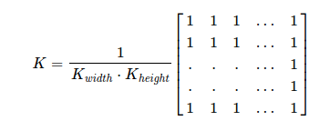

# Smoothing Images

## Goal
* blur()   
* GaussianBlur()   
* medianBlur()   
* bilateralFilter()   

## Theory

Smoothing 작업을 하기 위해서 *filter*를 이미지에 적용하여야 한다. 가장 유명하고 단순한 필터는 *linear*이며, 출력 픽셀 값(*g(i.j)*)들은 입력 픽셀 값(*f(i+k,j+l)*)들의 *weight*에 따라서 정해진다. kernel Array 내부의 값의 크기를 weight라고 합니다.    

**g(i,j)=∑f(i+k,j+l)h(k,l)**   

*h(k,l)*은 *kernel*이라고 부른다. 커널은 Filter의 Coefficient(계수)를 의미한다. 앞으로도 kernel은 Image Filtering에서 계속 활용할 예정이다.      

이제 Filter의 종류에 대해 알아봅시다.

### Normalized box Filter

   

이 필터는 가장 쉽습니다. 각각의 *output pixel*들은 기준 pixel의 neighbor이웃 들의 mean평균 값으로 정해집니다. 그들 모두가 동등한 weight를 가집니다.    

```cpp
cv2::blur(src, dst, Size(i,i), Point(-1,-1));
```
* src: Source image   
* dst: Destination image   
* Size(w,h): Defines the size of the kernel to be used ( of width w pixels and height h pixels)   
* Point(-1, -1): 앵커 포인트는 기준점을 뜻합니다. kernel은 Array이기 때문에 많은 좌표들이 있는데, 이 좌표들 중 어떤 점을 측정할 pixel 점으로 잡을 지를 정하는 것입니다. 음수 값을 넣으면 자동으로 Center가 Anchor Point가 됩니다.   

### Gaussian Filter
   
**1차원 Gaussian Filter kernel**   

* 아마 가장 유용한 필터일 것입니다.(가장 빠르진 않습니다) 가우시안 필터링은 각 포인트들을 *Gaussian Kernel*에 해당하는 Input Array에 대입하여 합성한 후에 모두 더하여 output Array에 적용합니다.   
* 위의 사진과 같이 kernel의 중앙에 해당하는 pixel 값의 Weight(G(x))가 가장 큰 것을 볼 수 있습니다.
* 2차원에도 적용될 수 있습니다. 

```cpp
cv2::GaussianBlur(src,dst,Size(i,i),0,0);
```
* Size(w,h): 이미지 사이즈입니다. 단, w,h는 Gaussian에서 σx, σy의 확률분포를 사용하기 위해 반드시 **홀수**여야 합니다.   
* σx: 표준편차입니다. 0으로 설정할 시, kerenl size(w,h)에 기반하여 자동으로 계산됩니다.   
* σy: 위와 동일한 y축 표준편차입니다.   

### Median Filter
Normalize와 동일한 원리지만 자신을 제외한 주변 neighborhood의 평균값으로 output pixel이 결정됩니다.

```cpp
cv2::medianBlur(src,dst,i);
```
* i: 사각형 커널의 사이즈입니다. 반드시 **홀수**여야 합니다.   

### Bilateral Filter
대부분의 필터들은 *Noise*를 제거하는 것 뿐 아니라, *edge*를 *Smoothing*합니다. 이는 분명 개발자가 원하지 않던 방향일 수 있습니다. 이를 해결하는 것이 Bilateral Filter입니다.   

Gaussiang Filter와 마찬가지로, Bilateral Filter 또한 *neighboor*의 Pixel과 Weight를 고려합니다. 대신 Bilateral은 두 가지의 Component(구성요소)를 가지는데, 첫번째는 Gaussian Filter로부터 사용되는 Weight이고, 두 번째는 neigboor과 자신의 밀도 차이를 고려한 측정 값입니다.   

```cpp
cv2::bilateralFilter(src, dst, i, i*2, i/2);
```
* i: 각 픽셀의 neighboorhood의 분포 범위를 정해줍니다.   
* σColor: 색 분포(Gaussian)의 표준편차입니다.   
* σSpace: 각 좌표 관점(밀도)에서의 표준편차입니다.   


